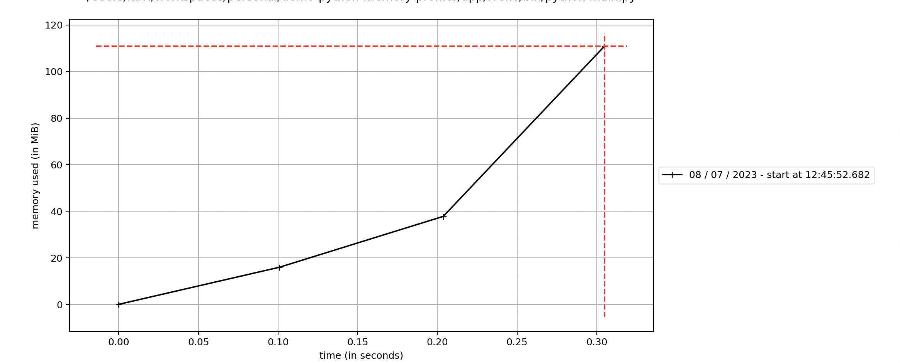

# Python Memory Profiler

## Description

A python package that show the memory usage of your script.

## Setup

```
poetry add memory_profiler matplotlib
```


You can run your script with the memory profiler by executing the following command:


```
poetry run mprof run main.py
```

You can plot your data. The following command will generate a PNG file with the memory usage:

```
poetry run mprof plot
```




## References

- https://pypi.org/project/memory-profiler/